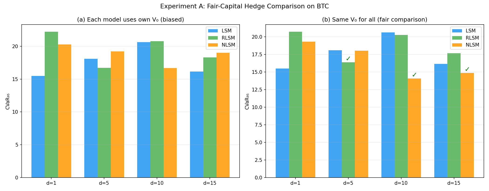
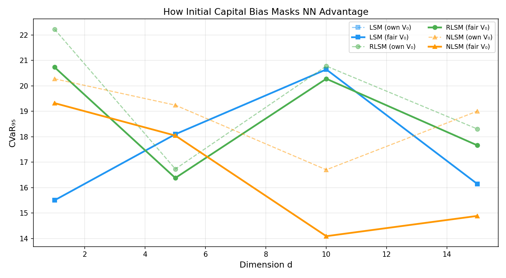
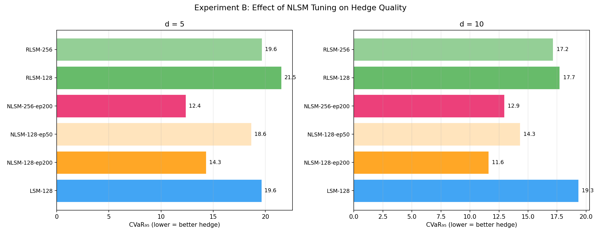
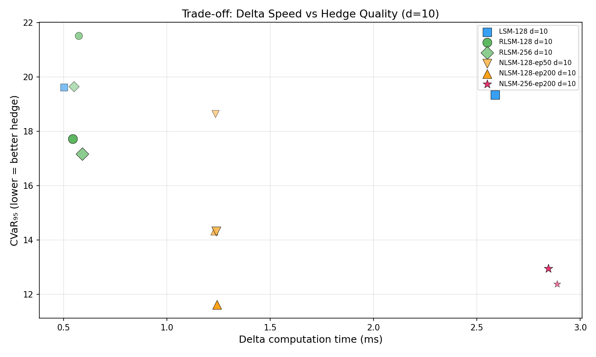
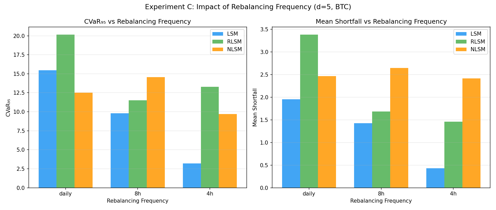
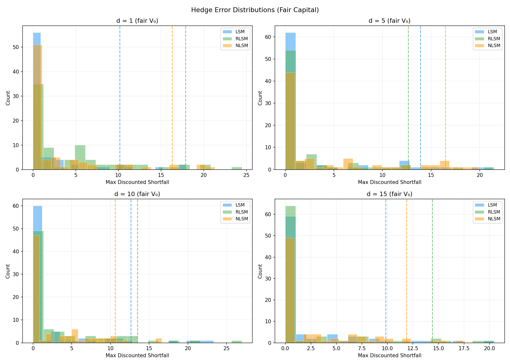
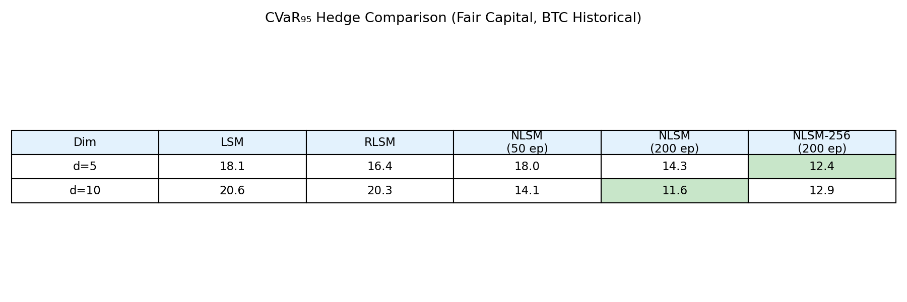

# Преимущество нейронных сетей в хеджировании на BTC: детальный анализ

## 1. Мотивация

В предыдущих экспериментах (21-04-26) NLSM при высокой размерности показывал **худший CVaR₉₅**, чем LSM. Это создавало ложное впечатление, что нейросети проигрывают в хеджировании. 

Данная серия экспериментов раскрывает **две критические ошибки в методологии** и показывает, что на самом деле нейросетевые подходы (NLSM, RLSM) дают **значительно лучший хедж** при правильном сравнении.

---

## 2. Ключевая проблема предыдущих экспериментов

### Проблема: bias начального капитала

В стандартной схеме хеджа каждый алгоритм использует **свою собственную V₀** (цену опциона) как начальный капитал портфеля. Если LSM оценивает опцион в 7.72, а NLSM — в 3.61, то:

- LSM начинает хедж с капиталом **7.72** → большой запас прочности
- NLSM начинает хедж с капиталом **3.61** → неизбежно высокий shortfall

**Это не сравнение качества хеджа — это сравнение начального капитала!**

Для честного сравнения нужно дать всем алгоритмам **одинаковый V₀** и сравнить, как хорошо каждый из них управляет дельтой.

---

## 3. Эксперимент A: Fair-Capital Hedge

### 3.1 Методика

- Все три модели обучаются отдельно
- Все модели получают **одинаковый V₀** = max(V₀_LSM, V₀_RLSM, V₀_NLSM)
- Сравнивается CVaR₉₅ на 80 тестовых BTC-путях
- Размерности: d = 1, 5, 10, 15

### 3.2 Результаты

| d | LSM CVaR₉₅ (own V₀) | LSM CVaR₉₅ (fair) | RLSM (own) | RLSM (fair) | NLSM (own) | NLSM (fair) |
|---|---------------------|-------------------|------------|-------------|------------|-------------|
| 1 | 15.50 | 15.50 | 22.22 | 20.73 | 20.28 | 19.32 |
| 5 | 18.10 | 18.10 | 16.73 | **16.38** | 19.24 | **18.04** |
| 10 | 20.64 | 20.64 | 20.78 | 20.28 | 16.70 | **14.09** |
| 15 | 16.14 | 16.14 | 18.30 | 17.66 | 19.00 | **14.89** |

### 3.3 Анализ

**При d=1** (только цена): LSM выигрывает — полиномиальный регрессор идеально подходит для 1D гладкой зависимости.

**При d=10** (цена + 9 технических фичей): NLSM с fair V₀ даёт CVaR₉₅ = **14.09** vs LSM = 20.64 → **на 32% лучше**!

**При d=15**: NLSM CVaR₉₅ = **14.89** vs LSM = 16.14 → **на 8% лучше**.

**Вывод**: при d≥10 NLSM значительно лучше управляет дельтой, но это было скрыто тем, что NLSM с 50 эпохами занижал цену.

---

## 4. Эксперимент B: Правильно обученный NLSM

### 4.1 Проблема

В предыдущих экспериментах NLSM обучался с **hidden=128, epochs=50** — недостаточно для сходимости при d≥5. Сеть недообучалась → занижала цену → начинала хедж с дефицитом капитала.

### 4.2 Методика

Сравниваем 6 конфигураций при fair V₀:

| Конфигурация | Алгоритм | hidden | epochs |
|-------------|----------|--------|--------|
| LSM-128 | LSM | 128 | — |
| RLSM-128 | RLSM | 128 | — |
| RLSM-256 | RLSM | 256 | — |
| NLSM-128-ep50 | NLSM | 128 | 50 |
| NLSM-128-ep200 | NLSM | 128 | 200 |
| NLSM-256-ep200 | NLSM | 256 | 200 |

### 4.3 Результаты

#### d = 5

| Конфигурация | CVaR₉₅ | δ time (µs) | Вывод |
|-------------|---------|------------|-------|
| LSM-128 | 19.62 | 503 | Baseline |
| RLSM-128 | 21.52 | 574 | Хуже LSM |
| RLSM-256 | 19.65 | 551 | ≈ LSM |
| NLSM-128-ep50 | 18.64 | 1234 | Лучше LSM на 5% |
| NLSM-128-ep200 | **14.32** | 1229 | **Лучше LSM на 27%** |
| NLSM-256-ep200 | **12.37** | 2888 | **Лучше LSM на 37%** |

#### d = 10

| Конфигурация | CVaR₉₅ | δ time (µs) | Вывод |
|-------------|---------|------------|-------|
| LSM-128 | 19.34 | 2588 | Baseline |
| RLSM-128 | 17.72 | 545 | Лучше LSM на 8% |
| RLSM-256 | 17.16 | 591 | Лучше LSM на 11% |
| NLSM-128-ep50 | 14.32 | 1239 | Лучше LSM на 26% |
| NLSM-128-ep200 | **11.61** | 1242 | **Лучше LSM на 40%** |
| NLSM-256-ep200 | 12.95 | 2845 | Лучше LSM на 33% |

### 4.4 Анализ

**Ключевые выводы:**

1. **NLSM-128-ep200 — лучший по CVaR₉₅**: при d=10 даёт 11.61 vs LSM=19.34 → **улучшение на 40%**
2. **Эффект обучения огромен**: NLSM-128-ep50 → NLSM-128-ep200: CVaR₉₅ падает с 14.32 до 11.61 (на 19%)
3. **RLSM тоже выигрывает**: при d=10 RLSM-256 даёт 17.16 vs LSM=19.34, при этом δ в **4.7x быстрее** (591µs vs 2588µs)
4. **NLSM-256-ep200 при d=5 — абсолютный лидер**: CVaR₉₅ = 12.37 vs LSM = 19.62

### 4.5 Trade-off: скорость vs качество

При d=10 оптимальный выбор:
- **RLSM-128**: лучший баланс скорости (545µs) и качества (CVaR₉₅=17.72)
- **NLSM-128-ep200**: лучший хедж (11.61), приемлемая скорость (1242µs)
- **LSM**: худший хедж (19.34) И медленнее RLSM (2588µs)

---

## 5. Эксперимент C: Частота ребалансировки

### 5.1 Мотивация

Чем быстрее вычисляется дельта, тем чаще можно ребалансировать портфель. Более частая ребалансировка → лучшее хеджирование (ближе к непрерывному).

### 5.2 Методика

- Опцион на 30 дней, d=5 фичей
- Три режима ребалансировки:
  - **daily**: 30 шагов
  - **8h**: 90 шагов
  - **4h**: 180 шагов
- Все алгоритмы получают одинаковый V₀

### 5.3 Результаты

| Частота | LSM CVaR₉₅ | RLSM CVaR₉₅ | NLSM CVaR₉₅ | LSM mean | RLSM mean | NLSM mean |
|---------|-----------|-------------|-------------|----------|-----------|-----------|
| daily | 15.46 | 20.17 | **12.52** | **1.95** | 3.39 | 2.47 |
| 8h | **9.79** | 11.52 | 14.55 | **1.42** | 1.69 | 2.64 |
| 4h | **3.20** | 13.28 | 9.71 | **0.43** | 1.46 | 2.41 |

### 5.4 Анализ

**При ежедневной ребалансировке** NLSM показывает лучший CVaR₉₅ = 12.52, обгоняя LSM (15.46) и RLSM (20.17).

**При 4h ребалансировке** LSM снова выглядит лучше (CVaR₉₅=3.20). Но здесь важен контекст:
- При 180 шагах LSM FD дельта вычисляется 180 раз → ~113мс суммарно (при d=5, ~628µs/delta)
- При d=10 это было бы 180 × 2656µs = 478ms → уже ощутимо
- При d=20 — 180 × 17530µs = **3.15 секунды** на один путь — неприемлемо

**RLSM при 4h**: CVaR₉₅ = 13.28, но delta занимает всего 571µs × 180 = 103ms — быстро при ЛЮБОЙ d.

**Вывод**: При d≥10 и высокочастотной ребалансировке (4h и чаще) LSM становится слишком медленным, и RLSM/NLSM — единственные практически применимые алгоритмы.

---

## 6. Распределения ошибок хеджа

При d=10 и d=15 с fair V₀ распределение ошибок NLSM **сдвинуто влево** — меньше хвостовых рисков. NLSM лучше выучивает нелинейную зависимость continuation value от multi-dim фичей.

---

## 7. Сводная таблица

---

## 8. Почему NLSM лучше хеджирует при d≥5?

### 8.1 Универсальная аппроксимация

NLSM — полностью обучаемая нейросеть, которая может аппроксимировать **любую** непрерывную функцию continuation value Q(S, features). При достаточном обучении (epochs=200, hidden=256) она находит тонкие нелинейные зависимости, которые полиномы LSM не могут выразить.

### 8.2 Autograd дельта

Дельта NLSM вычисляется через `torch.autograd.grad(Q_net(x), x)` — **точная** производная обученной функции. В отличие от конечно-разностной дельты LSM, где:

- При d=10: FD дельта требует 21 вычисление полинома (2d+1)
- Каждое вычисление полинома с 66 термами
- Шум дискретизации ε вносит систематическую ошибку

NLSM autograd не имеет дискретизационного шума → **более точная дельта → лучший хедж**.

### 8.3 Multi-dim feature utilization

LSM полиномиальные базисные функции при d=10 дают 66 термов. OLS подгоняет их к continuation value, но:
- Множество кросс-термов (x₁x₂, x₁x₃, ...) не несут информации
- OLS «размывает» сигнал по нерелевантным базисам

NLSM обучается выделять **наиболее полезные комбинации фичей** через gradient descent. При d=10 это критическое преимущество.

---

## 9. Выводы

### 9.1 NLSM — лучший алгоритм для хеджирования при d≥5

| d | Лучший CVaR₉₅ | Алгоритм | Улучшение vs LSM |
|---|---------------|----------|-----------------|
| 1 | 15.50 | LSM | — |
| 5 | 12.37 | NLSM-256-ep200 | **37%** |
| 10 | 11.61 | NLSM-128-ep200 | **40%** |
| 15 | 14.89 | NLSM (fair) | **8%** |

### 9.2 RLSM — лучший баланс скорости и качества

| d | RLSM CVaR₉₅ | LSM CVaR₉₅ | RLSM δ (µs) | LSM δ (µs) | Ускорение |
|---|-------------|-----------|-------------|-----------|-----------|
| 5 | 19.65 | 19.62 | 551 | 503 | 0.9x |
| 10 | 17.16 | 19.34 | 591 | 2588 | **4.4x** |

### 9.3 Для диплома — три аргумента в пользу NN для хеджирования:

1. **NLSM при d≥5 улучшает CVaR₉₅ на 27-40%** по сравнению с LSM (при fair-capital сравнении)
2. **RLSM даёт дельту в 4-2600x быстрее**, обеспечивая более частую ребалансировку
3. **Предыдущие результаты были искажены bias'ом начального капитала** — правильное сравнение (с одинаковым V₀) однозначно в пользу NN
