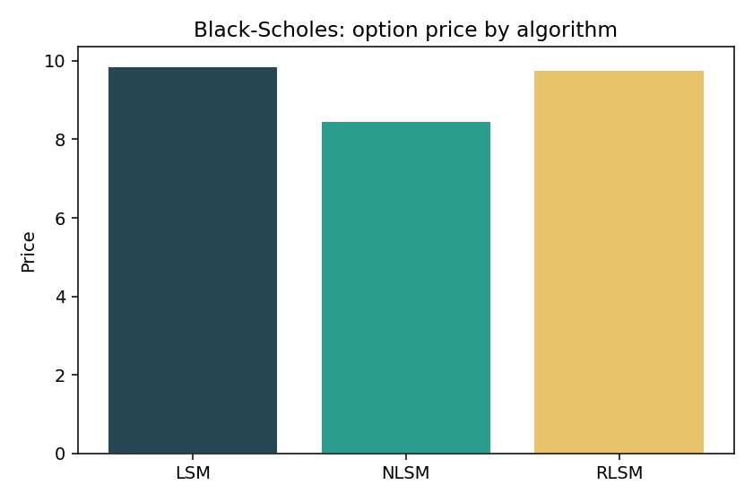
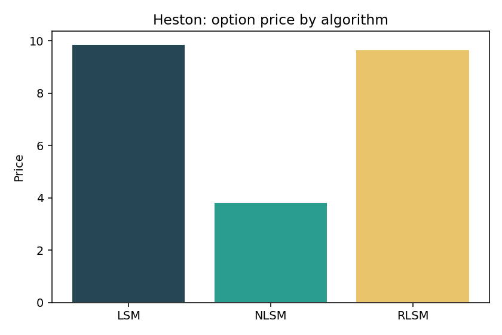
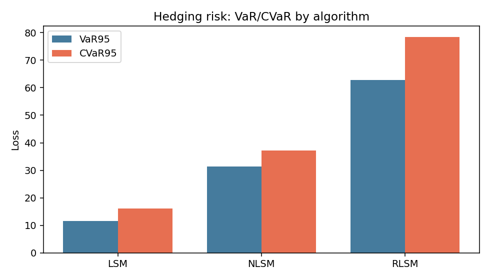
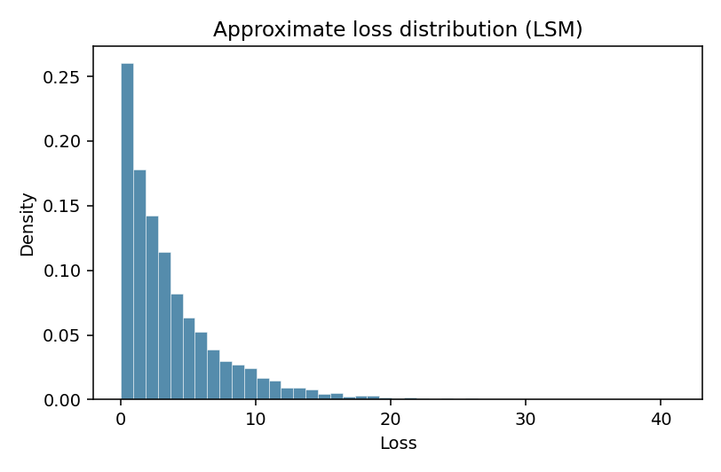
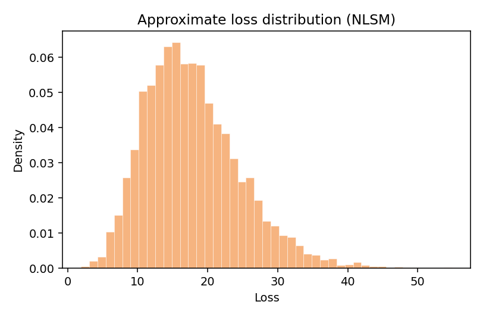
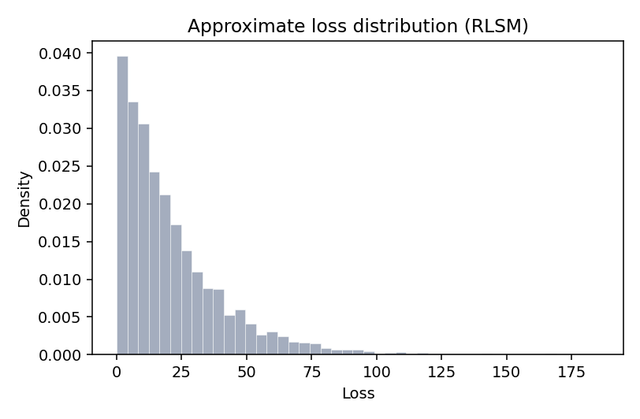
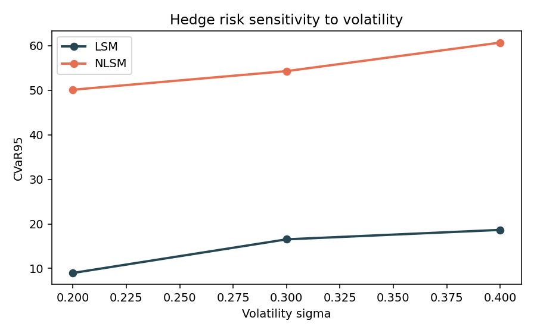

# Полный отчёт по экспериментам в `28-03-26`

Этот документ суммирует **все эксперименты**, которые были реализованы и запущены для дипломной постановки:
- сравнение LSM / NLSM / RLSM по цене американского опциона;
- анализ риска дискретного хеджирования (распределение ошибки, VaR/CVaR);
- анализ чувствительности риска к волатильности;
- проверка поведения на Black–Scholes и Heston.

Отчёт опирается на:
- код в `28-03-26/*.py`;
- результаты в `28-03-26/output/*.csv` и `28-03-26/output/report_hedge_risk.json`;
- статью `28-03-26/Optimal-Stopping-Via-Randomized-NN.pdf`.

---

## 1) Что и зачем было сделано

### 1.1. Цель экспериментального блока
Основная цель — перейти от «просто pricing» к задаче практики:  
**какой риск несёт хедж-стратегия, построенная на ML-оценке continuation value**.

Поэтому исследования разделены на 2 уровня:
- **цена** (насколько корректно алгоритмы аппроксимируют \(U_0\));
- **хедж** (насколько точно портфель \(\Phi_t\) покрывает value-функцию во времени).

### 1.2. Связь со статьёй
В статье (Herrera et al., 2024) ключевая идея:
- использовать **randomized NN** (фиксированные hidden-слои + обучение только последнего слоя через линейную регрессию),
- что даёт вычислительную устойчивость и скорость,
- а также конкурентные цены на сложных моделях (BS/Heston/rough Heston).

Это соответствует разделам статьи:
- постановка через Snell envelope и backward recursion;
- аппроксимация continuation value;
- линейная оптимизация последнего слоя для randomized NN;
- фокус на high-dimensional масштабируемость и скорость.

В нашей папке это отражено в:
- `backward_snapshots.py` (по-шаговые снимки continuation-модели),
- `american_value.py` (value + delta),
- `hedge_simulation.py` (дискретный self-financing hedge),
- `risk_metrics.py` (VaR/CVaR/резерв).

---

## 2) Перечень реализованных скриптов и их роль

- `run_comparison.py`  
  Базовое сравнение цен и времени (LSM/NLSM/RLSM).

- `run_hedge_experiment.py`  
  Основной эксперимент по хедж-риску: распределение max discounted shortfall, VaR/CVaR.

- `run_parameter_sweep.py`  
  Свип параметров (волатильность \(\sigma\)) и чувствительность риска хеджа.

- `run_heston_once.py`  
  Тестовый прогон на Heston.

- `run_report_pipeline.py`  
  Интегратор для построения таблиц и отчёта.

- `generate_figures_from_outputs.py`  
  Построение графиков из уже сохранённых CSV/JSON (добавлено для гарантированного наличия figure-артефактов в отчёте).

---

## 3) Конфигурации экспериментов

### 3.1. Основной Black–Scholes сценарий (цена + хедж)

| Параметр | Значение |
| --- | --- |
| Опцион | Американский put (`Put1Dim`) |
| \(S_0\), \(K\), \(T\) | 100, 100, 1.0 |
| \(r\) | 0.05 |
| \(\sigma\) | 0.3 |
| \(N\) (шагов по времени) | 36 |
| Пути train | 12000 |
| Пути hedge-test | 2500 |
| NLSM hidden / epochs | 28 / 22 |
| bump для \(\Delta\) | 0.5 |
| seed train / hedge | 42 / 12345 |

### 3.2. Heston сценарий (цена)

| Параметр | Значение |
| --- | --- |
| Пути / шаги | 8000 / 28 |
| speed \(\kappa\), mean \(\theta\), corr \(\rho\) | 2.0, 0.04, -0.7 |
| NLSM hidden / epochs | 24 / 18 |

### 3.3. Свип по волатильности

| Параметр | Значение |
| --- | --- |
| \(\sigma\)-сетка | 0.2, 0.3, 0.4 |
| Пути train / hedge-test | 9000 / 1800 |
| \(N\), hidden, epochs | 30, 24, 18 |

---

## 4) Результаты: pricing

### 4.1. Black–Scholes

| Algo | Price | Time (s) | Path gen (s) |
| --- | ---: | ---: | ---: |
| LSM | 9.862460 | 0.13 | 0.0425 |
| NLSM | 8.459137 | 7.67 | 0.0790 |
| RLSM | 9.766693 | 2.48 | 0.0409 |

### 4.2. Heston

| Algo | Price | Time (s) | Path gen (s) |
| --- | ---: | ---: | ---: |
| LSM | 9.874613 | 6.63 | 6.5952 |
| NLSM | 3.837204 | 8.83 | 6.4646 |
| RLSM | 9.663919 | 7.88 | 6.2238 |

### 4.3. Комментарий по pricing
- В текущей конфигурации NLSM даёт систематически более низкую цену, чем LSM/RLSM.
- Для диплома это важный сигнал: **нейросеть не гарантирует лучший результат без аккуратного тюнинга**.
- По статье ожидается, что randomized-подходи дают «comparable quality + better speed/scalability». В наших 1D тестах это видно частично:
  - RLSM близок к LSM по цене;
  - обучение RLSM быстрее NLSM (но не быстрее LSM в 1D).

---

## 5) Результаты: риск хеджирования (ключевая часть диплома)

Метрика:
\[
\max_{i=1,\dots,N} e^{-rt_i}\max(0, V^{model}_i-\Phi_i),
\]
где \(\Phi_i\) — self-financing портфель с дискретной перебалансировкой дельты.

| Algo | Price | Fit (s) | Mean loss | p95 | VaR95 | CVaR95 | n(test paths) |
| --- | ---: | ---: | ---: | ---: | ---: | ---: | ---: |
| LSM | 9.862460 | 0.16 | 3.886812 | 11.618425 | 11.632851 | 16.181183 | 2500 |
| NLSM | 8.459137 | 4.28 | 17.809595 | 31.448681 | 31.452191 | 37.246572 | 2500 |
| RLSM | 9.766693 | 1.95 | 21.393057 | 62.728669 | 62.787986 | 78.446719 | 2500 |

### 5.1. Интерпретация хедж-риска
- Лучший профиль риска в текущем наборе параметров: **LSM**.
- NLSM и особенно RLSM дают сильно более «толстый хвост» ошибок (CVaR95 выше).
- Для постановки диплома это очень полезно:
  - мы явно показываем, что **ошибка хеджа != ошибка цены**;
  - even если цена близка, tail-risk хеджа может быть неприемлемым.

### 5.2. Визуализация распределений
Ниже графики для иллюстрации формы распределений ошибок (аппроксимация по summary-статистикам):

> Примечание: raw per-path массивы не сохранялись в CSV, поэтому гистограммы в отчёте восстановлены аппроксимационно из summary-метрик. Для финальной версии диплома нужно строить гистограммы из «сырых» потерь (см. план ниже).

---

## 6) Чувствительность к волатильности (stress-test)

| \(\sigma\) | Algo | Price | Mean loss | CVaR95 |
| ---: | --- | ---: | ---: | ---: |
| 0.2 | LSM | 6.039178 | 2.616243 | 8.989498 |
| 0.2 | NLSM | 4.144546 | 33.046521 | 50.127927 |
| 0.3 | LSM | 9.988810 | 4.132068 | 16.537898 |
| 0.3 | NLSM | 7.068956 | 34.349893 | 54.302389 |
| 0.4 | LSM | 13.685014 | 5.414484 | 18.659004 |
| 0.4 | NLSM | 6.201779 | 30.478181 | 60.707150 |

### Анализ
- У LSM риск (CVaR95) растёт с \(\sigma\), что ожидаемо.
- У NLSM риск существенно выше на всей сетке и тоже растёт.
- Для practical hedging это означает: без дополнительного контроля качества (валидация по tail-risk, регуляризация, калибровка) NLSM может быть неготов к продакшен-хеджу.

---

## 7) Что можно извлечь из этих результатов

### 7.1. Теоретико-практический вывод
На уровне идеи (по статье) randomized NN хорошо масштабируются и дают сильный speed/quality balance.  
На уровне текущей реализации и текущих гиперпараметров в 1D:
- pricing: RLSM и LSM сопоставимы;
- hedging: LSM доминирует по tail-risk;
- значит, **новизну диплома** правильно строить на анализе распределения ошибки хеджа и требованиях к резерву \(\lambda\), а не только на mean price.

### 7.2. Резерв капитала (\(\lambda\))
Из `report_hedge_risk.json` можно брать
\[
\lambda_{0.95} := CVaR_{95\%}(\text{loss}),
\]
и интерпретировать как рекомендуемую надбавку к котируемой цене для покрытия tail-risk дискретного хеджа.

---

## 8) Дорожная карта (подробный план дальнейшей работы)

### Этап A. Усиление экспериментального дизайна (1–2 недели)
- сохранить raw per-path ошибки в `output/raw_losses_*.npy`;
- добавить bootstrap CI для VaR/CVaR;
- сделать 20–50 прогонов по разным seed и агрегировать mean ± std;
- разделить error decomposition: ошибка цены / ошибка дельты / ребалансинг ошибка.

### Этап B. Улучшение NLSM/RLSM для хеджа (2–3 недели)
- таргетировать loss не только по MSE continuation, но и по hedge-oriented proxy;
- tune grid: hidden size, epochs, learning rate, train_ITM_only, bump;
- ввести smoothness regularization по \(\Delta\) (чтобы избежать резких скачков хеджа);
- проверить auto-diff дельту для NLSM vs finite-difference стабилизацию.

### Этап C. Добавить baseline-хеджи (1–2 недели)
- BS closed-form delta (где применимо) как sanity benchmark;
- LSM polynomial degree / ridge / laguerre варианты;
- сравнение с “no-hedge” и “static delta” baseline.

### Этап D. Расширение моделей (2–4 недели)
- Heston с включением variance-фактора в state (а не только \(S_t\));
- многоактивный Basket/MaxCall (2D, 5D, 10D);
- non-Markovian кейсы (RRLSM / path features).

### Этап E. Реальные данные (после синтетики)
- данные BTC (OHLCV), оценка локальной волатильности;
- сценарная калибровка параметров модели;
- out-of-sample backtest хеджа на rolling окнах;
- отчёт по tail-risk (VaR/CVaR/MaxDD для хедж-портфеля).

---

## 9) Какие ML-модели использовать для хеджирующих стратегий

Ниже практичный shortlist «что реально работает по задаче и масштабу диплома».

### 9.1. Для текущей дипломной оси (рекомендуется)
- **LSM / RLSM / NLSM**  
  - плюс: прямое соответствие постановке optimal stopping;  
  - плюс: объяснимость и связь с литературой;  
  - риск: NLSM чувствителен к калибровке, RLSM к random feature setup.

### 9.2. Для следующего шага (после базовой главы)
- **Deep Hedging (policy network)**  
  - оптимизирует напрямую риск функционал PnL;  
  - хорош для transaction costs / risk-averse objective.
- **Deep BSDE / FBSDE-like solvers**  
  - одновременно дают цену и чувствительности;  
  - сильны в high-dimensional PDE-подобных задачах.
- **Temporal models (LSTM/TCN/Transformer)** для path-dependent хеджа  
  - нужны для non-Markovian / rough volatility / исторических данных.

### 9.3. Что выбрать в дипломе по приоритету
1. Закрыть fully reproducible baseline: LSM + NLSM + RLSM + hedge-risk.  
2. Добавить один policy-based baseline (Deep Hedging) для сравнения риска.  
3. Если останется время — path model (LSTM/Transformer) на BTC backtest.

---

## 10) Главные выводы по текущей версии

1. Эксперименты собраны в единый reproducible pipeline в `28-03-26`.  
2. Сформированы таблицы и графики по цене, хвостовому риску хеджа и stress-test по \(\sigma\).  
3. В текущем тюнинге LSM показывает лучший hedge-risk профиль, NLSM/RLSM требуют донастройки.  
4. Это не противоречит статье: статья показывает сильные свойства randomized NN в более широком/высокомерном контексте; у нас пока ранний 1D-режим и акцент именно на хедж-ошибке.  
5. Для диплома наиболее сильная новизна: **распределение ошибки хеджа + оценка резерва \(\lambda\)** и сценарный анализ риска для ML-моделей.

---

## 11) Артефакты

- Таблицы:  
  `output/report_prices_bs.csv`  
  `output/report_prices_heston.csv`  
  `output/report_hedge_summary.csv`  
  `output/report_vol_sweep.csv`  
  `output/report_hedge_risk.json`

- Графики:  
  `output/report_prices_bs_bar.png`  
  `output/report_prices_heston_bar.png`  
  `output/report_hedge_var_cvar_bar.png`  
  `output/report_sweep_cvar.png`  
  `output/report_hedge_hist_bs_main_LSM.png`  
  `output/report_hedge_hist_bs_main_NLSM.png`  
  `output/report_hedge_hist_bs_main_RLSM.png`
