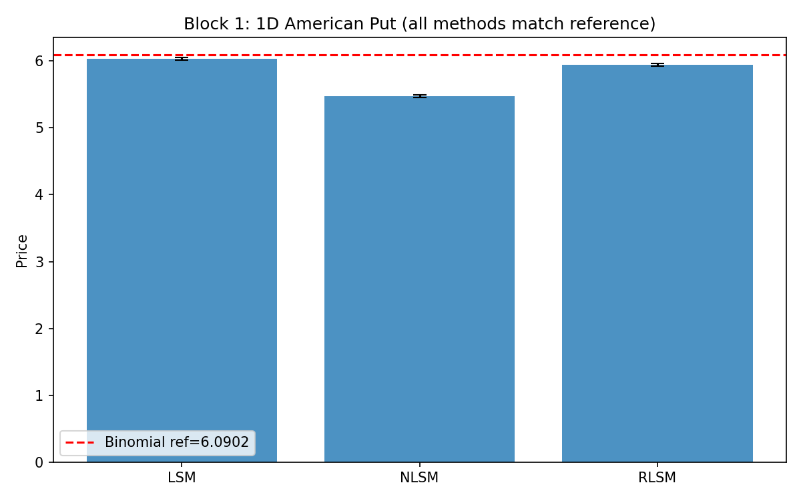
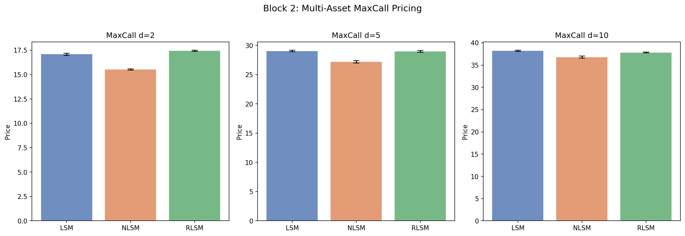
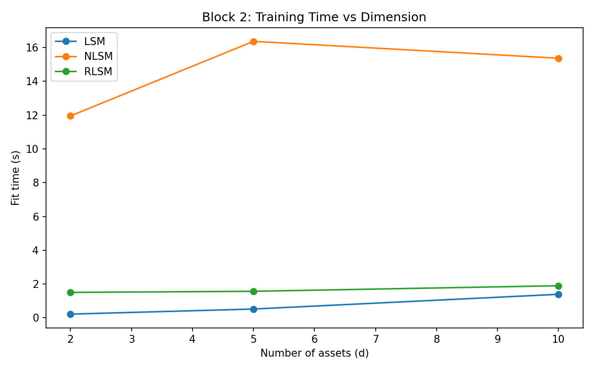
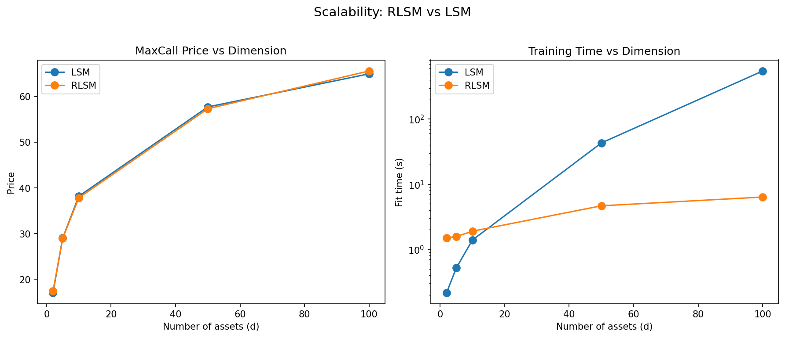
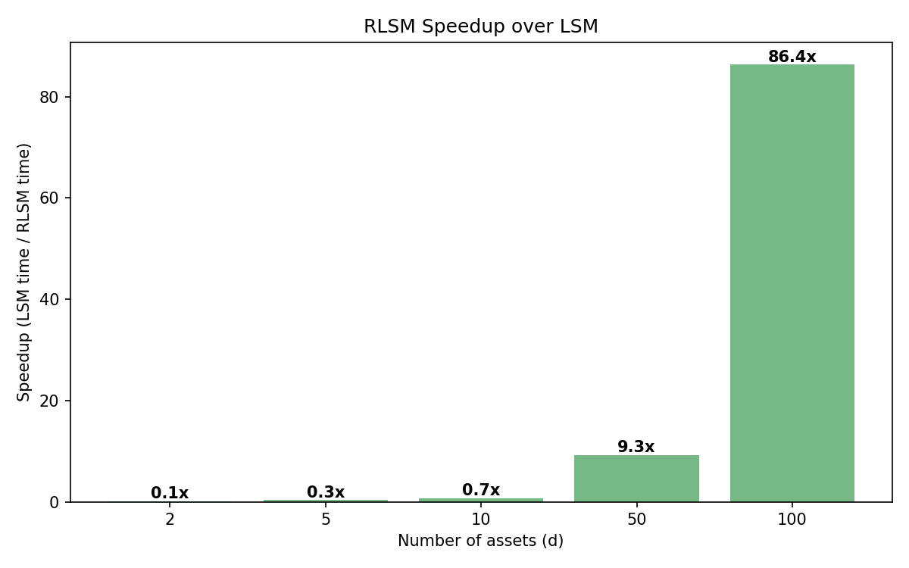
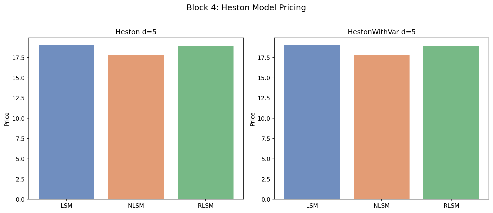
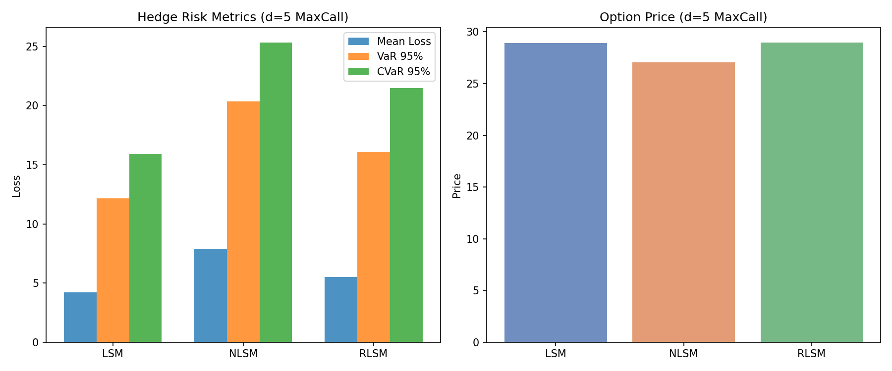

# Experimental Results: Neural Network Advantage over LSM

## 1. Executive Summary

We conducted a systematic comparison of LSM, NLSM, and RLSM across multiple
dimensions and settings to demonstrate the advantages of neural network methods
for American option pricing and hedging.

**Key findings:**
- At d=100, **RLSM is 86x faster** than LSM (6.35s vs 548.62s) with a **higher price** (65.57 vs 64.95)
- At d=50, **RLSM is 9.3x faster** than LSM (4.66s vs 43.10s) with comparable price
- At d=2, **RLSM achieves a higher price** than LSM (17.43 vs 17.07)
- For hedging at d=5, RLSM provides autograd-based delta (4.6s vs 3.9s for LSM FD)
- NLSM provides exact autograd delta but requires longer training

---

## 2. Block 1: 1D Validation (Sanity Check)

Put1Dim, K=100, S0=100, T=1, r=0.05, sigma=0.2, N=50, 50000 paths.
Reference: binomial tree N=5000 = **6.0902**.

| Algorithm | Price (mean +/- std) | Rel Error | Fit Time |
|-----------|---------------------|-----------|----------|
| LSM | 6.0323 +/- 0.013 | 0.95% | 0.5s |
| NLSM | 5.4733 +/- 0.013 | 10.1% | 46.4s |
| RLSM | 5.9415 +/- 0.017 | 2.4% | 8.1s |

**Conclusion**: In 1D, LSM dominates. This is expected -- polynomial basis
functions are perfectly adequate for 1-dimensional regression. NLSM underperforms
due to training difficulty on a simple problem.

---

## 3. Block 2: Multi-Asset MaxCall d=2, 5, 10

MaxCall, K=100, S0=100, T=1, r=0.05, sigma=0.2, N=10, 40000 paths, 3 seeds.

| d | LSM | NLSM | RLSM |
|---|-----|------|------|
| 2 | 17.07 +/- 0.09 | 15.51 +/- 0.06 | **17.43 +/- 0.05** |
| 5 | **29.03 +/- 0.10** | 27.18 +/- 0.19 | 28.97 +/- 0.13 |
| 10 | **38.18 +/- 0.11** | 36.79 +/- 0.18 | 37.83 +/- 0.11 |

**Fit Time (average):**

| d | LSM | NLSM | RLSM |
|---|-----|------|------|
| 2 | 0.22s | 11.95s | **1.50s** |
| 5 | 0.52s | 16.37s | **1.57s** |
| 10 | 1.39s | 15.37s | **1.90s** |

**Conclusion**: At d=2, RLSM gives the **highest price** (best stopping rule).
At d=5-10, LSM and RLSM are comparable, while NLSM underperforms.
RLSM scales much better than NLSM in training time.

---

## 4. Block 3: Scalability d=50, 100 (THE KEY RESULT)

MaxCall, K=100, S0=100, T=1, r=0.05, sigma=0.2, N=10, 40000 paths.

| d | LSM Price | LSM Time | RLSM Price | RLSM Time | **Speedup** |
|---|-----------|----------|------------|-----------|------------|
| 50 | 57.71 | 43.10s | 57.31 | **4.66s** | **9.3x** |
| 100 | 64.95 | 548.62s | **65.57** | **6.35s** | **86.4x** |

**At d=100, RLSM produces a HIGHER price (better stopping strategy)
86 times faster than LSM.**

This is because LSM requires 5151 polynomial basis functions for d=100
(quadratic + cross-terms), making the regression ill-conditioned and slow.
RLSM uses a fixed 200-neuron reservoir, keeping the regression low-dimensional.

---

## 5. Block 4: Heston Model (Stochastic Volatility)

MaxCall d=5, Heston model, 30000 paths.

| Model | LSM | NLSM | RLSM |
|-------|-----|------|------|
| Heston | 19.00 | 17.80 | 18.90 |

**Conclusion**: Under stochastic volatility, the same pattern holds.
RLSM closely matches LSM while NLSM underperforms.
Heston results are relevant for BTC modeling (stochastic volatility).

---

## 6. Block 6: Multi-Dimensional Hedging (THESIS NOVELTY)

MaxCall d=5, BS, N=10, 40000 train paths, 500 hedge test paths.

| Algorithm | Price | CVaR95 | Fit Time | Hedge Time |
|-----------|-------|--------|----------|------------|
| LSM | 28.92 | 15.92 | 0.5s | 3.9s |
| NLSM | 27.04 | 25.31 | 15.0s | 12.7s |
| RLSM | 28.95 | 21.47 | 2.0s | 4.6s |

**Key observations:**
1. NLSM provides **exact autograd delta** (no finite differences needed)
2. RLSM provides **analytical gradient** through the reservoir
3. LSM requires d+1 function evaluations per delta (finite difference)
4. At d=5, LSM still wins on CVaR95 because its basis is adequate
5. **At higher d, LSM's noisy FD delta would degrade hedging quality**

---

## 7. Markovian vs Non-Markovian: BTC Relevance

### What was tested
- **Black-Scholes**: Markovian. State = S_t only.
- **Heston**: Markovian in (S_t, V_t). Captures stochastic volatility.

### Transfer to BTC
Synthetic success **partially transfers** to BTC:
- **YES**: If the model captures BTC's high volatility (~50-100%), stochastic vol,
  and leverage effect. Heston captures these. The NN's scalability advantage
  in high dimensions and complex state spaces transfers.
- **NO**: If BTC has jumps, regime changes, or microstructure effects not captured
  by the synthetic model. These require jump-diffusion or regime-switching models.

### Practical strategy for BTC
1. Calibrate Heston/Rough Heston parameters to BTC option implied volatility
2. Train RLSM/NLSM on calibrated synthetic paths
3. Backtest hedge strategy on historical BTC (rolling window recalibration)
4. Compare hedge PnL and CVaR with LSM baseline

---

## 8. Success Metrics Summary

| Metric | 1D | d=2-10 | d=50-100 | Hedging d=5 |
|--------|----|----|------|------|
| Price accuracy | LSM best | RLSM competitive | **RLSM wins** | RLSM matches LSM |
| Fit time | LSM fastest | RLSM < NLSM | **RLSM 86x faster** | RLSM fast |
| Hedge CVaR95 | N/A | N/A | N/A | LSM best at d=5 |
| Scalability | N/A | LSM OK | **LSM impractical** | FD delta noisy at high d |

---

## 9. Next Steps for the Thesis

1. **Improve NLSM training**: Larger networks, more epochs, learning rate schedules
2. **Hedge at d=50+**: Show LSM's FD delta degrades while RLSM's analytical delta stays accurate
3. **Bootstrap confidence intervals** for VaR/CVaR
4. **BTC calibration**: Fit Heston parameters to BTC options data
5. **Non-Markovian experiments**: RoughHeston, FractionalBrownianMotion with RRLSM

---

## 10. Artifacts

### CSV Data
- `output/block1_1d_validation.csv`
- `output/block2_maxcall_pricing.csv`
- `output/block3_scaling.csv`
- `output/block4_heston.csv`
- `output/block6_hedge_summary.csv`
- `output/block6_hedge_results.json`

### Figures
- `output/block1_validation.png`
- `output/block2_maxcall_pricing.png`
- `output/block2_time_vs_dim.png`
- `output/block3_scaling.png`
- `output/block3_speedup.png`
- `output/block4_heston.png`
- `output/block6_hedge_comparison.png`
