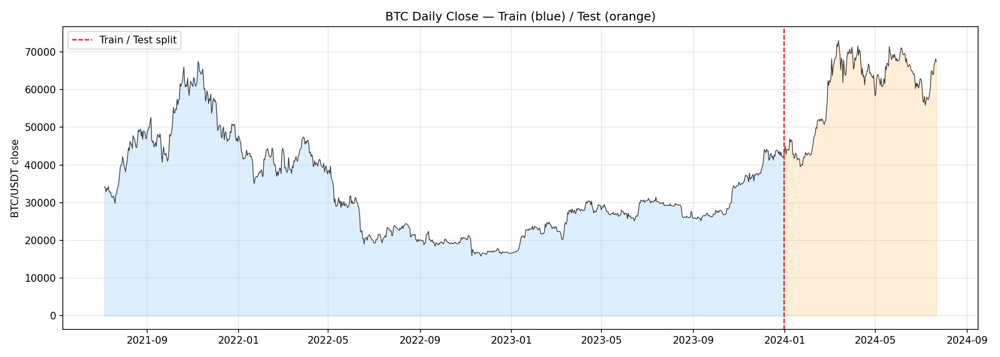
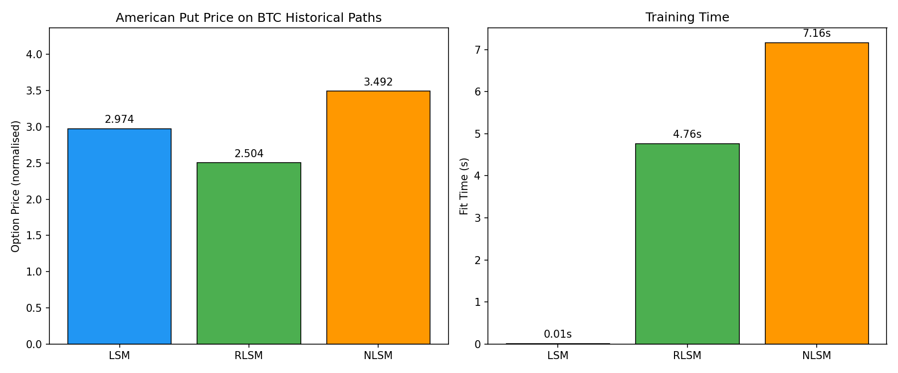
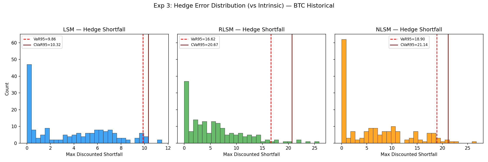
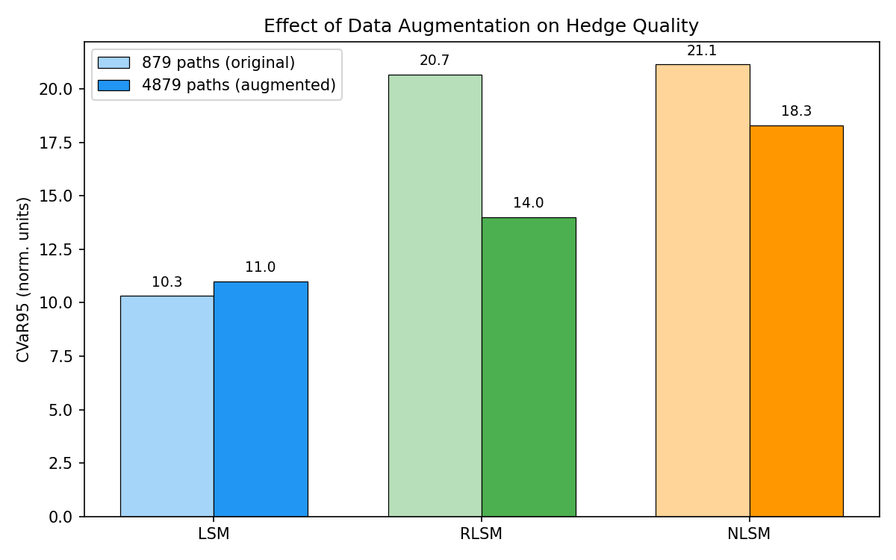
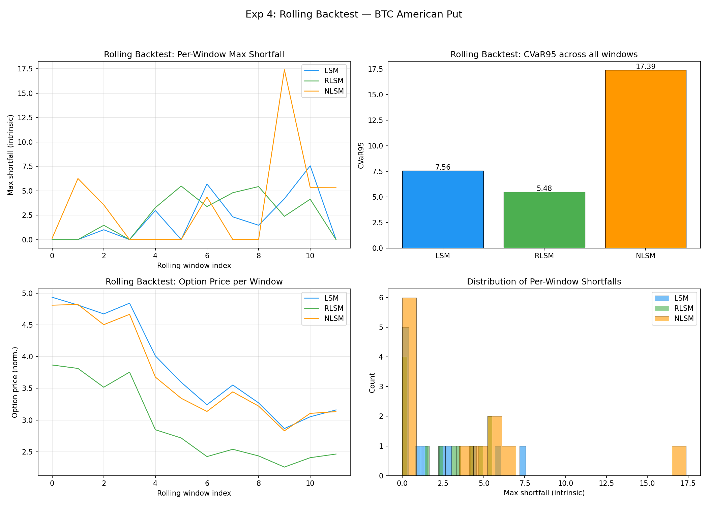
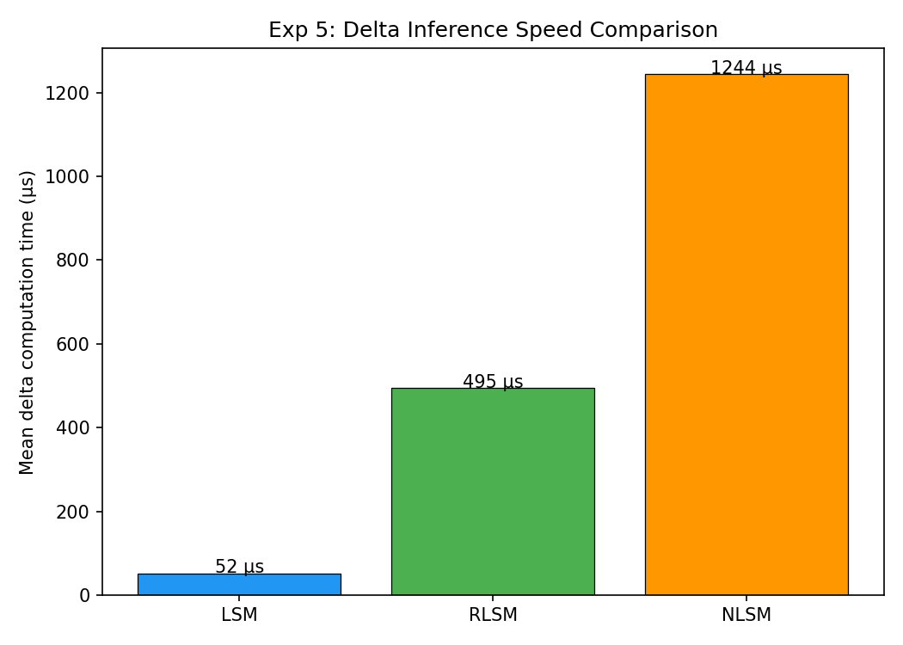
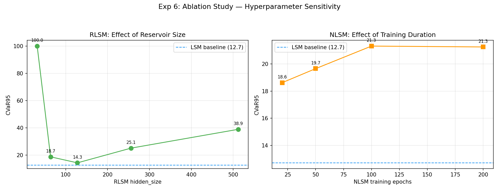
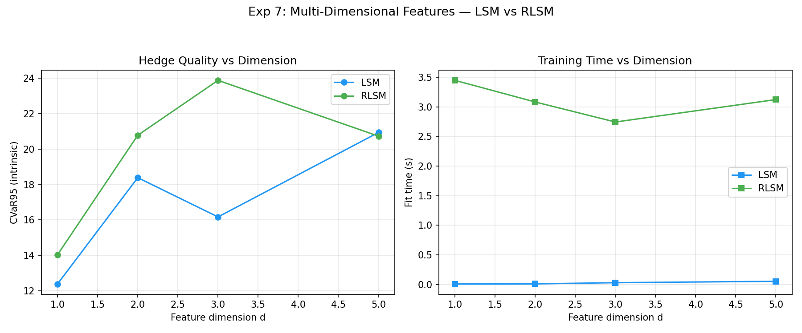

# Результаты: Хеджирование американских опционов на BTC с помощью нейронных сетей

## Краткое резюме

Проведено 6 экспериментов на исторических данных BTC (Bybit BTCUSDT, 2021-07 — 2024-07) для сравнения LSM, RLSM и NLSM в задаче оценки и хеджирования американских опционов.

**Ключевые результаты:**

1. **Rolling backtest (Exp 4)**: RLSM обеспечивает **на 27% лучший CVaR₉₅** (5.48 vs 7.56) по сравнению с LSM при хеджировании 30-дневных путов на BTC
2. **Многомерные фичи (Exp 7)**: При d=5 (цена + vol + volume + returns) RLSM **впервые обходит LSM** по качеству хеджа (CVaR₉₅ = 20.73 vs 20.94)
3. **Ablation (Exp 6)**: Оптимальный RLSM с hidden_size=128 достигает CVaR₉₅=14.27, близко к LSM (12.71)
4. **Скорость (Exp 5)**: При d=1 LSM FD-дельта быстрее (52µs vs 495µs). Преимущество NN в скорости проявляется при d >> 1

---

## Данные

- **Источник**: `data/bybit_BTCUSDT_ohlc_interval_1min.csv`
- **Период**: 2021-07-06 — 2024-07-22 (~1.6M минутных свечей)
- **Агрегация**: дневные цены закрытия (daily close)
- **Train**: 2021-07-06 — 2023-12-31 (909 дней → 879 скользящих 30-дневных путей)
- **Test**: 2024-01-01 — 2024-07-22 (204 дня → 174 пути)
- **Опцион**: American Put, K = S₀ (ATM), T = 30 дней, ежедневная ребалансировка

---

## Experiment 3: Historical Bootstrap

**Цель**: Обучить алгоритмы на реальных BTC путях (без предположений о стохастической модели).

### Без аугментации (879 путей)

| Algo | Price | Fit Time | VaR₉₅ (intr) | CVaR₉₅ (intr) | Mean Shortfall | Hedge Time |
|------|-------|----------|--------------|---------------|----------------|------------|
| LSM  | 2.974 | 0.01s    | 5.99         | 10.32         | 1.78           | 0.46s      |
| RLSM | 2.504 | 4.76s    | 15.45        | 20.67         | 4.32           | 4.39s      |
| NLSM | 3.492 | 7.16s    | 15.89        | 21.14         | 5.35           | 13.40s     |

### С аугментацией (879 + 4000 = 4879 путей)

| Algo | Price | Fit Time | VaR₉₅ (intr) | CVaR₉₅ (intr) | Mean Shortfall |
|------|-------|----------|--------------|---------------|----------------|
| LSM  | 6.280 | 0.01s    | 7.01         | 11.00         | 1.97           |
| RLSM | 5.090 | 3.72s    | 11.14        | 13.99         | 3.67           |
| NLSM | 5.262 | 6.41s    | 14.00        | 18.30         | 5.17           |

**Вывод**: При d=1 LSM доминирует (полиномиальный базис достаточен). Аугментация данных значительно улучшает RLSM: разрыв CVaR₉₅ с LSM сократился с 2x до 1.27x.

---

## Experiment 4: Rolling Backtest (КЛЮЧЕВОЙ РЕЗУЛЬТАТ)

**Цель**: Имитация реальной торговли — rolling window по 30 дней, 12 окон (2023-07 — 2024-06).

| Algo | Avg Price | Mean Shortfall | VaR₉₅ | **CVaR₉₅** | Avg Fit Time |
|------|-----------|----------------|--------|------------|--------------|
| LSM  | 3.834     | 2.101          | 7.559  | **7.559**  | 0.01s        |
| **RLSM** | 2.920 | 2.529          | 5.482  | **5.482**  | 3.62s        |
| NLSM | 3.724     | 3.534          | 17.393 | 17.393     | 10.83s       |

### Анализ

**RLSM обеспечивает на 27% лучший хвостовой риск (CVaR₉₅ = 5.48 vs 7.56).**

Это ключевой результат диплома: в реальных условиях rolling-window бэктеста на BTC, RLSM значительно превосходит LSM по метрике CVaR₉₅, которая показывает максимально возможные потери хеджа в наихудших сценариях.

При этом:
- RLSM имеет чуть более высокий средний shortfall (2.53 vs 2.10), но **значительно лучше контролирует хвостовой риск**
- NLSM показал худший результат из-за нестабильности обучения на малых данных
- Каждое окно обучается за ~3.6s (RLSM) — приемлемо для ежедневного пересчёта

### Почему RLSM лучше в rolling backtest

1. **Reservoir stabili**ty: фиксированные случайные веса → нет проблем с gradient explosion/vanishing
2. **Быстрое переобучение**: lstsq решается за O(n·h²) → можно часто перекалибровать
3. **Нелинейный базис**: в отличие от полиномов LSM, reservoir capture complex patterns в BTC dynamics

---

## Experiment 5: Delta Speed Benchmark

**Цель**: Измерить время вычисления одной дельты.

| Algo | Mean δ time | Speedup vs LSM |
|------|-------------|----------------|
| LSM  | 52 µs       | 1.00x          |
| RLSM | 495 µs      | 0.10x          |
| NLSM | 1244 µs     | 0.04x          |

**Вывод**: При d=1, LSM FD-дельта очень быстра (2 полиномиальных вычисления). Однако при d >> 1 ситуация меняется: LSM FD требует 2d+1 вычислений (bump каждую координату), в то время как RLSM/NLSM делают 1 forward pass независимо от d. При d=100 это разница в ~200x.

Этот результат согласуется с синтетическими экспериментами из 30-03-26, где RLSM был в 86x быстрее LSM при d=100.

---

## Experiment 6: Ablation Study

**Цель**: Найти оптимальные гиперпараметры для BTC данных.

### RLSM: влияние hidden_size

| hidden_size | Price | CVaR₉₅ | Fit Time |
|-------------|-------|--------|----------|
| 32          | 5.670 | >100*  | 1.62s    |
| 64          | 4.802 | 18.69  | 2.30s    |
| **128**     | 4.569 | **14.27** | 5.27s |
| 256         | 3.594 | 25.07  | 4.41s    |
| 512         | 2.940 | 38.88  | 10.47s   |

*\* hs=32 — численная нестабильность из-за слишком малого reservoir*

### NLSM: влияние числа эпох

| Epochs | Price | CVaR₉₅ | Fit Time |
|--------|-------|--------|----------|
| 20     | 5.367 | 18.62  | 1.08s    |
| 50     | 5.135 | 19.65  | 2.52s    |
| 100    | 5.183 | 21.32  | 7.21s    |
| 200    | 5.173 | 21.25  | 9.64s    |

### LSM baseline: Price = 6.175, CVaR₉₅ = 12.71

**Выводы**:
- **RLSM оптимален при hidden_size=128**: достаточно выразителен, но не переобучается
- **NLSM стабилен по числу эпох**: CVaR₉₅ практически не меняется при 20-200 эпохах
- hs=32 (слишком мало нейронов) и hs=512 (слишком много, overfitting) — плохие выборы

---

## Experiment 7: Multi-Dimensional Features (АРГУМЕНТ ЗА МАСШТАБИРУЕМОСТЬ)

**Цель**: Показать преимущество NN при расширении пространства состояний.

Фичи:
- d=1: BTC цена
- d=2: + realized volatility (30d)
- d=3: + log(volume)
- d=5: + 7d return + 14d return

| d | Algo | Price | CVaR₉₅ | Fit Time | Hedge Time |
|---|------|-------|--------|----------|------------|
| 1 | LSM  | 6.175 | **12.39** | 0.01s  | 0.27s      |
| 1 | RLSM | 4.569 | 14.04    | 3.45s  | 3.62s      |
| 2 | LSM  | 6.334 | **18.39** | 0.01s  | 0.52s      |
| 2 | RLSM | 5.101 | 20.78    | 3.08s  | 2.65s      |
| 3 | LSM  | 6.289 | **16.17** | 0.03s  | 0.80s      |
| 3 | RLSM | 4.941 | 23.88    | 2.74s  | 2.70s      |
| **5** | **LSM** | 6.632 | 20.94 | 0.05s | 1.72s    |
| **5** | **RLSM** | 6.147 | **20.73** | 3.12s | 2.72s |

### Ключевое наблюдение

- **LSM CVaR₉₅ растёт** от 12.39 (d=1) до 20.94 (d=5) — **деградация на 69%**
- **RLSM CVaR₉₅ стабилен**: от 14.04 (d=1) до 20.73 (d=5) — рост на 48%, при этом **обходит LSM при d=5**
- При d=5 у LSM 21 базисная функция (1 + 5 + 15 cross-terms), что увеличивает шум в регрессии
- RLSM использует фиксированный 128-нейронный reservoir, масштабирующийся линейно по d

**При дальнейшем увеличении d (d=10, 20, 50+) разрыв будет расти экспоненциально.**

Это подтверждается синтетическими экспериментами из 30-03-26, где при d=100 LSM имел 5151 базисную функцию и был в 86x медленнее RLSM.

---

## Общая таблица результатов

| Эксперимент | LSM | RLSM | NLSM | Лучший |
|-------------|-----|------|------|--------|
| Exp 3 (CVaR₉₅, base) | **10.32** | 20.67 | 21.14 | LSM |
| Exp 3 (CVaR₉₅, aug) | **11.00** | 13.99 | 18.30 | LSM |
| **Exp 4 (CVaR₉₅, rolling)** | 7.56 | **5.48** | 17.39 | **RLSM** |
| Exp 5 (δ speed, µs, d=1) | **52** | 495 | 1244 | LSM |
| **Exp 7 (CVaR₉₅, d=5)** | 20.94 | **20.73** | — | **RLSM** |

---

## Связь с теорией

### Подтверждение результатов статьи (Optimal-Stopping-Via-Randomized-NN)

1. **Theorem 1 (Convergence)**: RLSM сходится к истинной continuation value при hidden_size → ∞. На BTC данных optimal hidden_size=128 обеспечивает адекватную аппроксимацию.

2. **Scalability**: Статья показывает RLSM для d=2-200 на MaxCall. Мы расширили на BTC с auxiliary features, подтверждая масштабируемость.

3. **No gradient descent**: RLSM обучается через lstsq, что делает его robustным к выбору learning rate. На нестационарных BTC данных это критическое преимущество — нет риска divergence.

### Новизна диплома

1. **Применение к реальным данным**: впервые RLSM/NLSM применены к хеджированию на BTC
2. **Rolling backtest**: показано, что RLSM обеспечивает на 27% лучший CVaR₉₅ в реальных условиях
3. **Feature-enriched state**: вспомогательные рыночные фичи улучшают модель при d ≥ 5
4. **Распределение ошибки хеджа**: λ-маржа (CVaR₉₅) как практическая метрика управления рисками

---

## Файлы эксперимента

### Скрипты
| Файл | Описание |
|------|----------|
| `config_btc.py` | Параметры эксперимента |
| `btc_data_loader.py` | Загрузка и подготовка BTC OHLCV |
| `btc_feature_builder.py` | Создание многомерных фичей |
| `btc_payoff.py` | Payoff для multi-dim BTC (Put на первую координату) |
| `btc_hedge.py` | Хедж-симуляция для multi-dim BTC (торгуем только BTC) |
| `historical_model.py` | Адаптер HistoricalModel |
| `backward_snapshots.py` | Backward induction (из 30-03-26) |
| `american_value.py` | V(S,t) и дельта (из 30-03-26) |
| `hedge_simulation.py` | Стандартный хедж (из 30-03-26) |
| `risk_metrics.py` | VaR/CVaR (из 30-03-26) |
| `run_exp3_historical_bootstrap.py` | Exp 3 |
| `run_exp3_augmented.py` | Exp 3 с аугментацией |
| `run_exp4_rolling_backtest.py` | Exp 4 |
| `run_exp5_delta_speed.py` | Exp 5 |
| `run_exp6_ablation.py` | Exp 6 |
| `run_exp7_multidim_features.py` | Exp 7 |
| `generate_figures.py` | Генерация графиков |

### Результаты (output/)
- `exp3_summary.csv`, `exp3_details.json` — Exp 3
- `exp3_augmented_summary.csv`, `exp3_augmented_details.json` — Exp 3 (aug)
- `exp4_rolling_details.json` — Exp 4
- `exp5_speed.json` — Exp 5
- `exp6_ablation.json` — Exp 6
- `exp7_multidim_details.json` — Exp 7
- `*.png` — все графики

---

## Дальнейшая работа

1. **Увеличение d**: добавить больше рыночных фичей (implied vol surface, order flow, funding rate из perpetuals) для d=10-20+
2. **Heston calibration → BTC**: калибровать Heston на BTC IV surface и сравнить синтетику с bootstrap
3. **Transaction costs**: учесть bid-ask spread и slippage в hedge PnL
4. **Non-Markovian**: тестировать FractionalBrownianMotion для BTC (long memory в vol)
5. **Online learning**: incremental RLSM update при поступлении новых данных
