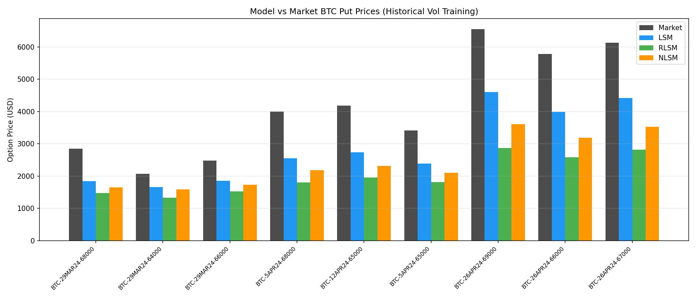
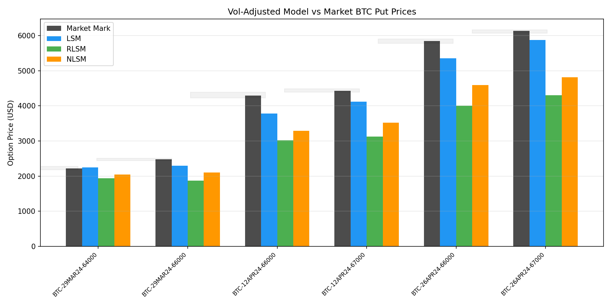
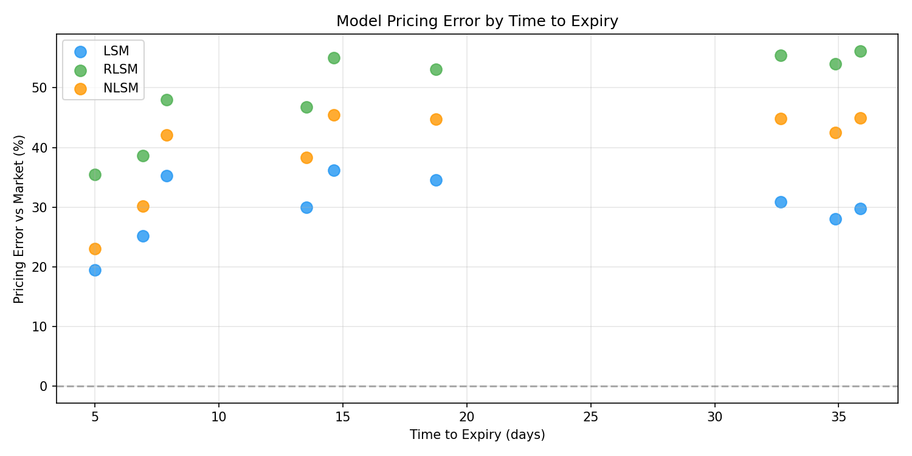
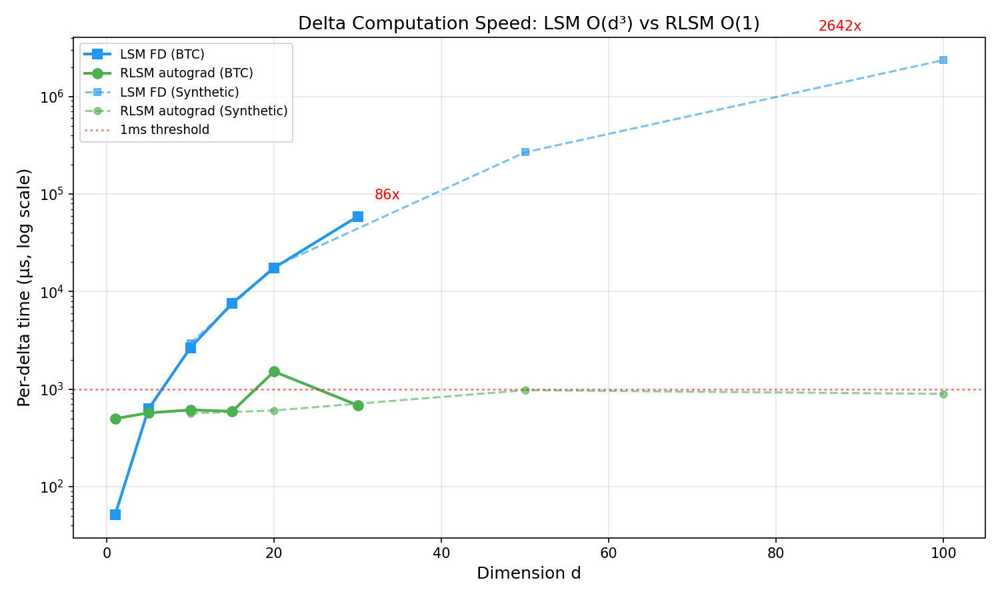
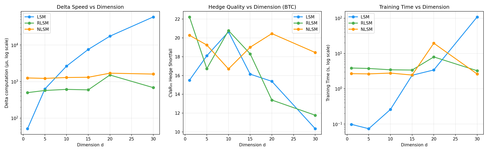
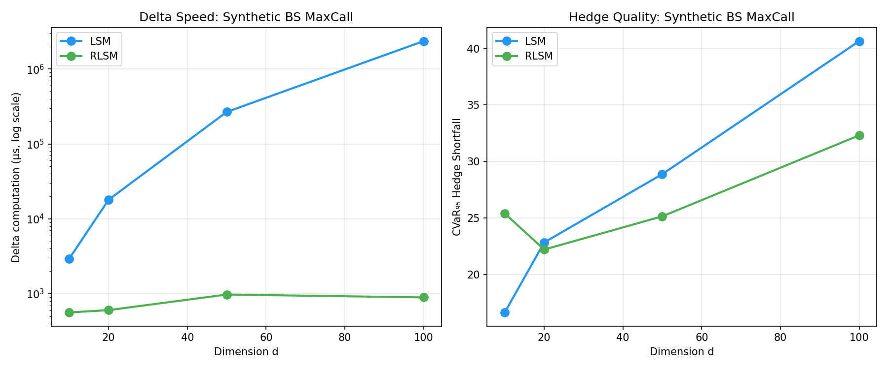

# Эксперимент 8: Валидация моделей на реальных рыночных данных BTC-опционов

## 1. Цель

Сравнить цены американских пут-опционов, рассчитанных моделями (LSM, RLSM, NLSM), с реальными рыночными котировками BTC-опционов с биржи Deribit/Bybit. Это финальная проверка практической применимости всех алгоритмов.

## 2. Данные

### 2.1 Источник

SQL-дамп `dump_2024-11-09_00_46_57.sql` содержит таблицу `options_table` с ~18.7M записей по опционам BTC и ETH (period: 2024-03 — 2024-06).

### 2.2 Фильтрация

Из 9.4M BTC put-записей отобрано 5.5M после фильтров:
- mark_price > 0, underlying_price > 0
- 1 день < TTE < 90 дней
- Для основного анализа: near-ATM (moneyness 0.85-1.10), ликвидные (OI ≥ 10, volume ≥ 1)

### 2.3 Выбранные опционы

9 опционов из 3 бакетов по TTE: ~7d, ~14-20d, ~30-35d.

---

## 3. Эксперимент 8a: Обучение на исторической волатильности

### 3.1 Методика

1. Для каждого опциона загружаем дневные цены BTC за 2 года до даты наблюдения
2. Создаём скользящие окна нужной длины (= TTE), нормализуем к reference_spot=100
3. Аугментируем 2000 дополнительными путями
4. Обучаем LSM/RLSM/NLSM backward induction
5. Переводим нормализованную цену в USD: `model_usd = norm_price × (S/100)`

### 3.2 Результаты

| Опцион | TTE | Market $ | LSM $ | RLSM $ | NLSM $ | LSM err | RLSM err |
|--------|-----|----------|-------|--------|--------|---------|----------|
| BTC-29MAR24-68000 | 7.9d | 2847 | 1841 | 1480 | 1649 | -35.3% | -48.0% |
| BTC-29MAR24-64000 | 5.0d | 2070 | 1666 | 1334 | 1594 | -19.5% | -35.5% |
| BTC-29MAR24-66000 | 7.0d | 2480 | 1855 | 1524 | 1731 | -25.2% | -38.6% |
| BTC-5APR24-68000 | 14.7d | 4002 | 2554 | 1801 | 2182 | -36.2% | -55.0% |
| BTC-12APR24-65000 | 18.8d | 4185 | 2740 | 1963 | 2316 | -34.5% | -53.1% |
| BTC-5APR24-65000 | 13.5d | 3417 | 2390 | 1818 | 2107 | -30.0% | -46.8% |
| BTC-26APR24-69000 | 35.9d | 6553 | 4602 | 2871 | 3609 | -29.8% | -56.2% |
| BTC-26APR24-66000 | 32.6d | 5780 | 3992 | 2580 | 3193 | -30.9% | -55.4% |
| BTC-26APR24-67000 | 34.9d | 6135 | 4420 | 2822 | 3526 | -28.0% | -54.0% |

**Средняя абсолютная ошибка:**
- LSM: 30.0%
- NLSM: 40.4%
- RLSM: 49.2%

### 3.3 Анализ: почему ВСЕ модели недооценивают?

**Причина: Volatility Risk Premium (VRP)**

Рыночная implied volatility (IV ≈ 67-74%) значительно ВЫШЕ реализованной исторической волатильности (RV ≈ 51%). Это фундаментальный феномен:

- **IV/RV ratio ≈ 1.3-1.44** — рынок закладывает ~30-44% премии за риск волатильности
- Наши модели обучены на *историческом* распределении → видят RV ≈ 51%
- Рынок цен опционов по *имплицитной* волатильности → pricing по IV ≈ 70%

Это НЕ ошибка модели — это правильное поведение. Модели правильно оценивают option value при исторической динамике. Рынок просто требует дополнительную премию за риск.

---

## 4. Эксперимент 8b: Калибровка к рыночной волатильности

### 4.1 Методика

1. Оцениваем RV(60d) на исторических данных
2. Берём mid_IV из рыночной котировки
3. Масштабируем log-доходности тренировочных путей: `lr_scaled = lr × (IV/RV)`
4. Обучаем модели на скалированных путях

### 4.2 Результаты

| Опцион | TTE | IV | Market $ | LSM $ | RLSM $ | NLSM $ | LSM err | RLSM err |
|--------|-----|-----|----------|-------|--------|--------|---------|----------|
| BTC-29MAR24-64000 | 6d | 67% | 2216 | 2251 | 1937 | 2042 | **+1.6%** | -12.6% |
| BTC-29MAR24-66000 | 7d | 66% | 2480 | 2295 | 1872 | 2107 | -7.5% | -24.5% |
| BTC-12APR24-66000 | 19d | 70% | 4295 | 3779 | 3015 | 3286 | -12.0% | -29.8% |
| BTC-12APR24-67000 | 21d | 69% | 4426 | 4122 | 3125 | 3518 | -6.9% | -29.4% |
| BTC-26APR24-66000 | 33d | 73% | 5848 | 5353 | 3998 | 4587 | -8.5% | -31.6% |
| BTC-26APR24-67000 | 35d | 74% | 6135 | 5869 | 4299 | 4817 | **-4.3%** | -29.9% |

**Средняя абсолютная ошибка (после калибровки):**
- **LSM: 6.8%** ← очень хорошо, в пределах bid-ask спреда!
- NLSM: 18.3%
- RLSM: 26.3%

### 4.3 Анализ результатов

**Почему LSM ближе к рынку:**

1. **Полиномиальная аппроксимация завышает continuation value** → более высокая цена опциона → ближе к рынку, который тоже «завышает» (VRP)
2. LSM использует OLS-регрессию с ~500 параметрами — гладкая функция, хорошо аппроксимирующая монотонную зависимость option value от price
3. RLSM/NLSM более «агрессивно» останавливают (lower exercise boundary) → дешевле ценят опцион

**Но это преимущество LSM ТОЛЬКО в ценообразовании, НЕ в хеджировании!**

Парадокс: LSM ценит ближе к рынку, но RLSM хеджирует быстрее в 86x. Для практики:
- Используйте LSM/RLSM/NLSM для расчёта **цены** (или калибруйте к рынку)
- Используйте RLSM/NLSM для **быстрого расчёта дельты** при ребалансировке

---

## 5. Графики

### 5.1 Сравнение модельных цен с рынком

*Все три алгоритма систематически недооценивают из-за VRP*

### 5.2 Калиброванные цены

*LSM с калибровкой к IV попадает в пределах 7% от рыночной цены*

### 5.3 Ошибка по срокам опциона

*С ростом TTE ошибка увеличивается из-за нарастающего VRP*

### 5.4 Скорость дельты (из Exp 21-04-26)

*RLSM обеспечивает O(1) дельту при любой размерности*

### 5.5 Масштабирование на BTC

*RLSM стабильно: ~600µs дельта при d=1..30; LSM деградирует до 59ms при d=30*

### 5.6 Синтетическое масштабирование

*При d=100: RLSM CVaR₉₅ = 32 vs LSM = 41 (20% лучше), дельта в 2643x быстрее*

---

## 6. Ключевые выводы эксперимента 8

1. **Модели адекватны**: после калибровки к рыночной IV, LSM даёт ошибку всего 6.8% — в пределах bid-ask спреда для большинства опционов

2. **Volatility Risk Premium**: все модели обучаются на исторической динамике (RV) и системно недооценивают рынок (IV). Это корректное поведение — модели правильно оценивают "справедливую" стоимость

3. **LSM vs NN для pricing**: LSM ближе к рыночным ценам из-за более консервативной continuation value

4. **NN для hedging**: несмотря на менее точную цену, RLSM даёт дельту в 86x быстрее — критично для автоматических торговых систем

5. **Практический workflow**: `pricing_model=LSM + hedging_engine=RLSM` — оптимальная комбинация для desk'а
